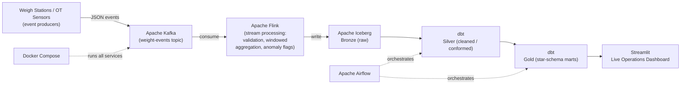

# WeighStream-OT

**Real-time streaming lakehouse for industrial weight / operational-technology (OT) telemetry — built end-to-end with Kafka, Flink, Apache Iceberg, dbt, Airflow, and Streamlit.**


---

## Overview

**WeighStream-OT** is an end-to-end data engineering pipeline that ingests, processes, stores, and visualizes a continuous stream of industrial weighing-station (operational technology) readings in near real time.

Industrial scales and weighbridges emit a high-frequency stream of weight, timestamp, and device-health events. WeighStream-OT turns that raw telemetry into clean, queryable, analytics-ready data: it captures events as they happen, validates and aggregates them in flight, lands them in an ACID lakehouse, models them into business-ready marts, and surfaces live operational metrics on an interactive dashboard.

The project demonstrates a complete modern data stack — streaming ingestion, stateful stream processing, a transactional lakehouse, ELT transformations, orchestration, and a serving layer — all containerized and reproducible with a single command.

---

## Architecture



**Flow in one sentence:** Sensor events → **Kafka** (durable ingestion) → **Flink** (real-time processing) → **Iceberg** (lakehouse storage) → **dbt** (medallion transformations) → **Streamlit** (analytics), with **Airflow** orchestrating the batch layer and **Docker Compose** running the whole stack.

---

## Tech Stack

| Layer | Technology | Role in the pipeline |
|---|---|---|
| **Ingestion** | Apache Kafka | Durable, replayable buffer for high-throughput sensor events |
| **Stream processing** | Apache Flink (PyFlink) | Stateful validation, tumbling-window aggregations, real-time anomaly detection |
| **Lakehouse storage** | Apache Iceberg | ACID table format with schema evolution and time travel |
| **Transformation** | dbt-core | Medallion modeling (Bronze → Silver → Gold), tests, documentation |
| **Orchestration** | Apache Airflow | Schedules and monitors dbt runs and batch jobs as DAGs |
| **Serving / BI** | Streamlit | Interactive, live operational dashboard |
| **Containerization** | Docker & Docker Compose | One-command, reproducible local deployment |
| **Language** | Python 3.11 | Producers, Flink jobs, glue code |

---

## Data Modeling — Medallion Architecture

The lakehouse is organized into three progressively refined layers:

- **🥉 Bronze** — Raw events as written by Flink, exactly as received from Kafka. Append-only, full fidelity, the system of record.
- **🥈 Silver** — Cleaned and conformed: deduplicated, type-cast, null-handled, and enriched with derived fields. One row per validated weighing event.
- **🥇 Gold** — Business-ready **star-schema** marts (fact + dimension tables) powering the dashboard: per-station throughput, average load, anomaly counts, and time-bucketed trends.

dbt tests (`not_null`, `unique`, accepted-range, and relationship tests) run against the Silver and Gold layers to enforce data quality on every build.

---

## Key Features

- **Real-time ingestion** of high-frequency OT sensor events through Kafka.
- **Stateful stream processing** in Flink — windowed aggregations and live anomaly flagging on weight thresholds.
- **ACID lakehouse** on Apache Iceberg with schema evolution and snapshot time-travel.
- **Modular ELT** with dbt: layered models, reusable macros, and automated data-quality tests.
- **Orchestrated batch layer** via Airflow DAGs with retries, scheduling, and observability.
- **Live dashboard** in Streamlit visualizing throughput, anomalies, and station-level metrics.
- **Fully containerized** — the entire multi-service stack spins up with `docker compose up`.

---

## Getting Started

> **Note:** Commands below assume the repo ships a `docker-compose.yml` that defines all services. Adjust paths/service names to match your setup.

### Prerequisites
- [Docker](https://www.docker.com/) and Docker Compose
- ~8 GB free RAM (Kafka + Flink + Airflow are memory-hungry)
- Python 3.11+ (only if running producers/scripts outside containers)

### 1. Clone the repository
```bash
git clone https://github.com/Sriraj-V/weighstream-ot.git
cd weighstream-ot
```

### 2. Launch the stack
```bash
docker compose up -d
```
This starts Kafka, Flink, the Iceberg catalog, Airflow, and supporting services.

### 3. Start the event producer
```bash
python producers/weigh_station_producer.py
```
This streams simulated weigh-station events into the `weight-events` Kafka topic.

### 4. Run the Flink job
The Flink job consumes from Kafka and writes to the Iceberg Bronze layer (submitted automatically by Compose, or manually via the Flink UI / CLI).

### 5. Build the dbt models
```bash
docker compose run --rm dbt dbt build
```
Or let **Airflow** trigger it on schedule from the DAG.

### 6. Open the dashboards

| Service | URL |
|---|---|
| Streamlit dashboard | http://localhost:8501 |
| Airflow UI | http://localhost:8080 |
| Flink dashboard | http://localhost:8081 |

---

## Project Structure

```
weighstream-ot/
├── producers/            # Kafka event producers (sensor simulation)
├── flink/                # PyFlink stream-processing jobs
├── iceberg/              # Iceberg catalog & table configs
├── dbt/                  # dbt project: models (bronze/silver/gold), tests, macros
│   └── models/
├── airflow/              # DAGs orchestrating the batch/transform layer
├── dashboard/            # Streamlit application
├── docker-compose.yml    # Full multi-service stack
└── README.md
```

---

## Screenshots

> _Add screenshots of the Streamlit dashboard and Airflow DAG graph here — recruiters scan visuals first._

| Live Operations Dashboard | Airflow DAG |
|---|---|
| _`docs/dashboard.png`_ | _`docs/airflow_dag.png`_ |

---

## Roadmap / Future Improvements

- CI/CD for dbt runs via GitHub Actions
- Schema Registry (Avro/Protobuf) for Kafka contract enforcement
- Great Expectations for expanded data-quality validation
- Deploy to cloud (AWS MSK + EMR/Flink + S3-backed Iceberg)
- Alerting on anomaly thresholds (Slack / email)

---

## Author

**Sriraj Vaddepelli** — Data Engineer
[LinkedIn](https://linkedin.com/in/srirajvaddepelli) · [GitHub](https://github.com/Sriraj-V)

---

